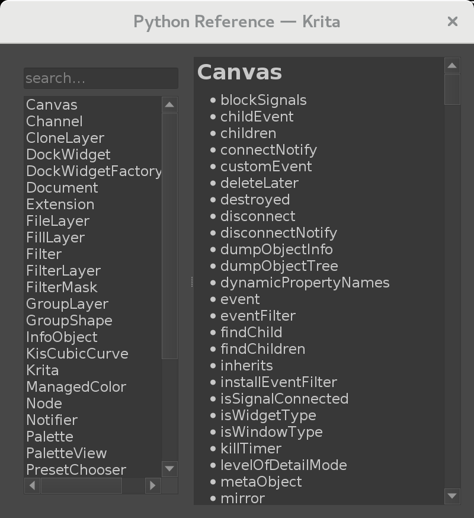
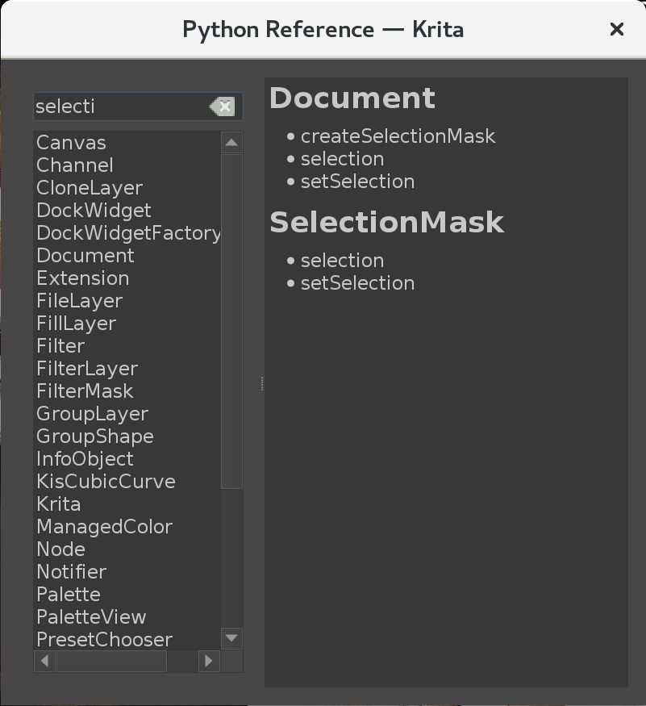

# Krita Python API Reference Plugin

A Krita plugin that displays a searchable overview of the Python API.

The reference is built at run time via Python's introspection abilities and hence always matching your Krita version. Since the API doesn't expose any doc strings or method signatures, this plugin can only list method names.

 

## Installation

1. [Download the source as zip](https://github.com/rbreu/krita-plugin-python-reference/archive/master.zip) and unzip it somewhere; the extracted _plugin_ folder is going to be the relevant one.
2. Go to your Krita resource folder and create the directories _actions_ and _pykrita_.
3. Copy the directory _plugin/python_reference_ and the file _plugin/python_reference.desktop_ into the _pykrita_ folder.
4. Copy the file _plugin/python_reference.action_ into the _actions_ folder.
5. Restart Krita.
6. Go to _Settings -> Configure Krita -> Python Plugin Manager_ and enable the Python API Reference Plugin.

You should then be able to access the plugin via _Tools -> Scripts -> Python API Reference_.